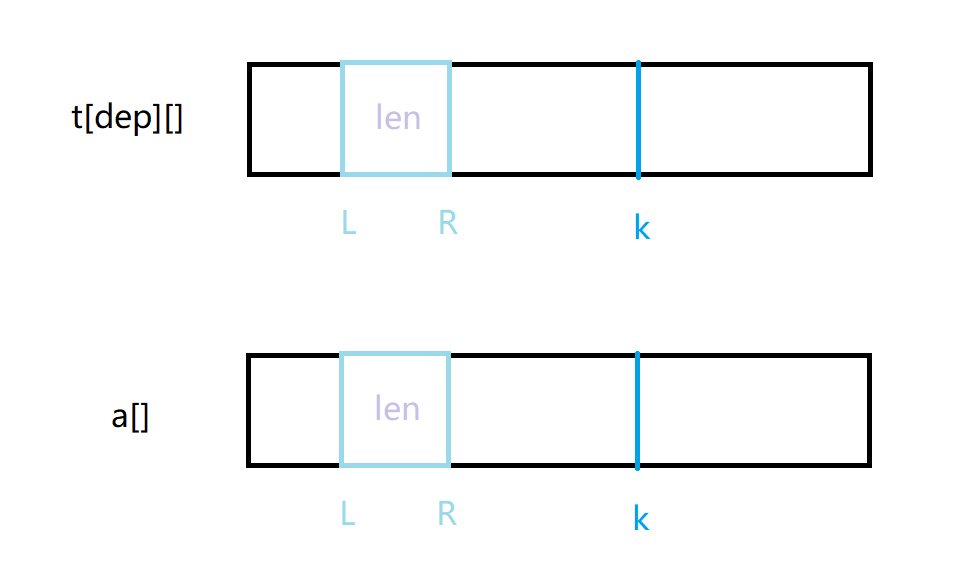
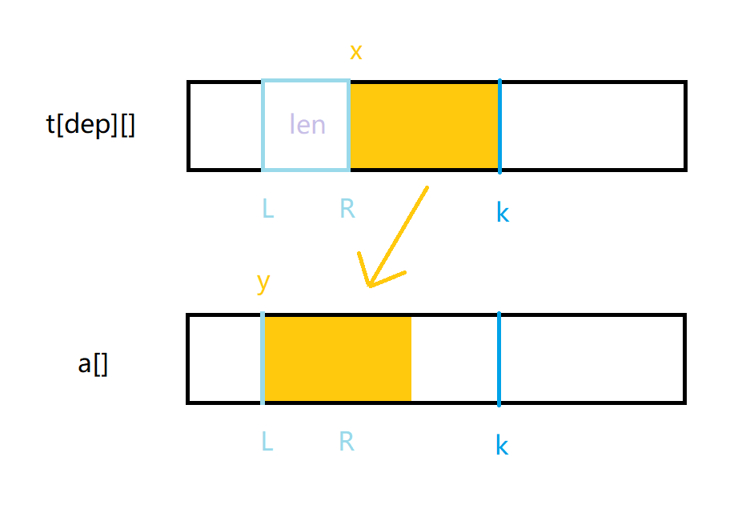
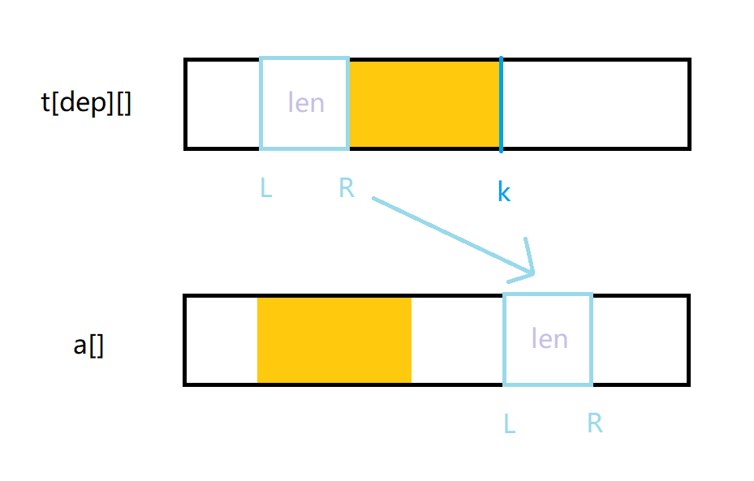

> 原文发表于 <time datetime="2021-07-22T23:22:00+08:00">2021-07-22 23:22（北京时间）</time> · [博客园原文](https://www.cnblogs.com/atomsh/p/15046926.html)。本文保留原文内容与代码，仅整理排版。

原题：

[180. 排书 - AcWing题库](https://www.acwing.com/problem/content/182/)

题意：

给你n个数的任意排列，现在要你通过从中选出一段，然后插入某个位置的操作将这n个数按顺序依次排列，同时操作次数最少。

分析：

普通的dfs肯定会超时间复杂度，所以要用IDA\*，也就是迭代加深+估价函数。

代码有三个函数，f()表示估价函数。因为一次移动最多可以改变三个位置的后继，所以遍历当前排列，记录不满足a\[i\]=a\[i-1\]+1的位置个数cnt。最优的情况无非就是每次移动都正好使位置点的后继满足顺序，即只需要(cnt/3)上取整次操作。

check()是用来检查当前状态是否满足顺序。

由于用到迭代加深，dfs()中的dep是用来记录深度限制的。在这里主要想模拟一下区间移动的过程，虽然可能不难理解，但是图解会清晰一些。当前要对t\[dep\]与a数组进行交换，a记录的是转移后的结果，其中L、R表示需要转移的区间左右端点，len表示之间的长度，k（代码中的loc）表示的是需要插入的位置。

1. 首先，因为两个数组一开始都是一样的，把t\[dep\]复制给a。



2. 转移\[L,R\]后，\[R+1,k\]前移，因此直接转移\[R+1,k\]至L处。



3. 转移\[L,R\]到k位置后，其他位置不变，转移完成。



题解：

```cpp
#include <bits/stdc++.h>
using namespace std;
const int N=20;
int a[N],t[5][N];
int n;

int f()
{
    int cnt=0;
    for(int i=2;i<=n;i++)
    {
        if(a[i]!=a[i-1]+1) cnt++;
    }
    return (cnt+2)/3;
}
bool check()
{
    for(int i=2;i<=n;i++)
    {
        if(a[i]!=a[i-1]+1) return false;
    }
    return true;
}
bool dfs(int step,int dep)//当前移动步数，深度限制
{
    if(step+f()>dep) return false;//超限制
    if(check()) return true;

    //枚举开始位置l、移动长度len、移动到的位置loc
    for(int l=1;l<=n;l++)
    {
        for(int len=1;len+l-1<=n;len++)
        {
            int r=l+len-1;
            for(int loc=r+1;loc<=n;loc++)
            {
                //为什么t要开二维呢？因为需要往下递归然后回溯
                //不能覆盖之前深度的数组
                memcpy(t[step],a,sizeof a);
                //转移数组，更新状态
                int x,y;//x表示新数组中的位置，y表示原始数组中的位置
                for(x=r+1,y=l;x<=loc;x++,y++)
                {
                    a[y]=t[step][x];
                }
                for(x=l;x<=r;x++,y++)
                {
                    a[y]=t[step][x];
                }
                if(dfs(step+1,dep)) return true;
                memcpy(a,t[step],sizeof a);
            }
        }
    }

    return false;
}

int main()
{
    int T;
    cin>>T;

    while(T--)
    {
        cin>>n;

        for(int i=1;i<=n;i++) cin>>a[i];

        int dep=0;
        while(!dfs(0,dep)&&dep<5)
        {
            dep++;
        }
        if(dep>=5) cout<<"5 or more"<<endl;
        else cout<<dep<<endl;
    }
}
```

以上代码参考yxc老师的部分代码，yxcyyds！
