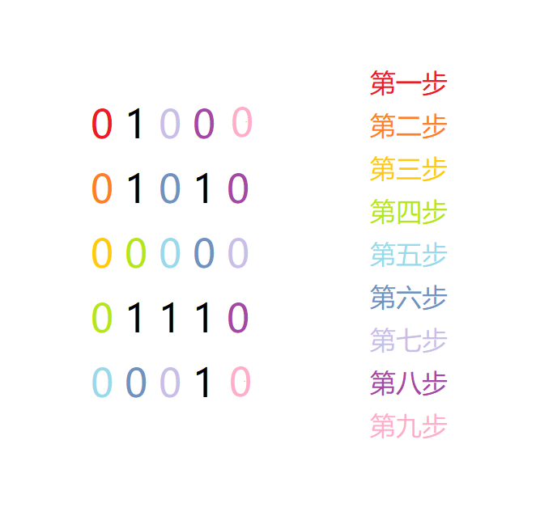

> 原文发表于 <time datetime="2021-07-04T19:57:00+08:00">2021-07-04 19:57（北京时间）</time> · [博客园原文](https://www.cnblogs.com/atomsh/p/14969741.html)。本文保留原文内容与代码，仅整理排版。

原题： [1076. 迷宫问题 - AcWing题库](https://www.acwing.com/problem/content/1078/)

题意：给一个n\*n的迷宫，1表示墙，0表示路，让你找出从左上角（0，0）点走到右下角（n-1，n-1）点的最短路径，并且输出这条最短路径上的每一个坐标。

分析：

很明显是bfs，但在想的时候因为对bfs理解不够清楚所以想简单了，本来以为只要输出bfs过程中的每一步就可以了，后来看了题解才知道要用数组记录路径，于是把bfs过程重新想了一遍。bfs是一层一层推进的，所以每一层都用颜色标记了。



对于每一层的推进，这层的每一个点都会被遍历到，但并不代表都在最短路径上。因为需要输出点的坐标，所以要用数组记录每一点的上一个位置，这样就可以通过传递，输出整条路径。

题解：

```cpp
#include <bits/stdc++.h>
#define PII pair<int,int>
using namespace std;
const int N=1005;
int n,g[N][N];
int xx[4]={0,1,0,-1};
int yy[4]={1,0,-1,0};
PII pre[N][N];//用来记录答案，记录当前位置的前一个位置

void bfs()
{
    memset(pre,-1,sizeof pre);

    queue<PII> q;
    q.push({n-1,n-1});
    //从终点往起点推，因为记录答案的数组是记录上一个点的位置，所以从路径的结束点开始往前推

    while(q.size())
    {
        auto t=q.front();
        q.pop();
        int x=t.first,y=t.second;
        //cout<<x<<" "<<y<<endl;

        for(int i=0;i<4;i++)
        {
            int nx=x+xx[i];
            int ny=y+yy[i];

            if(nx>=0&&nx<n&&ny>=0&&ny<n&&(g[nx][ny]==0)&&(pre[nx][ny].first==-1))
            {//pre[nx][ny].first==-1说明当前点还没有被搜过
                q.push({nx,ny});
                pre[nx][ny]=t;
            }
        }
    }
}

int main()
{
    cin>>n;

    for(int i=0;i<n;i++)
    {
        for(int j=0;j<n;j++)
        {
            cin>>g[i][j];
        }
    }

    bfs();

    PII now={0,0};

    while(1)
    {
        cout<<now.first<<" "<<now.second<<endl;
        if(now.first==n-1&&now.second==n-1) break;
        now=pre[now.first][now.second];
    }

    return 0;
}
```

以上代码参考yxc老师的部分代码，yxcyyds！
